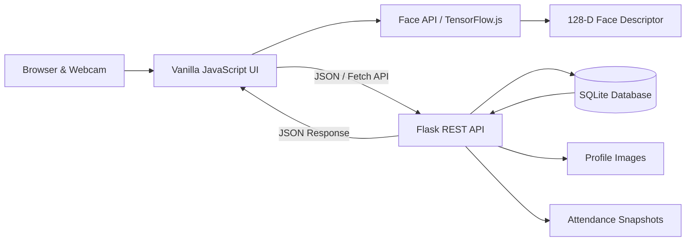
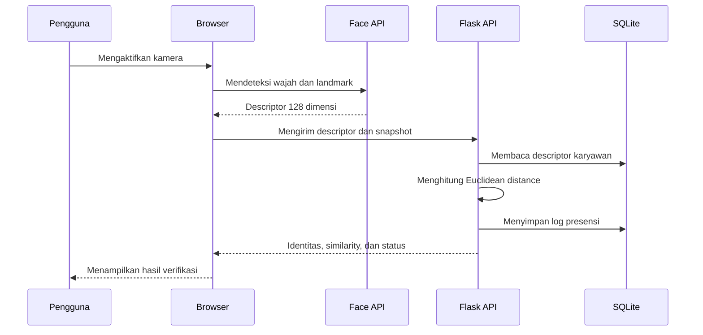

<div align="center">

# 🔐 Absen.io

### Sistem Presensi Biometrik Berbasis Pengenalan Wajah

Aplikasi presensi modern berbasis web yang menggabungkan **Flask**, **SQLite**, dan **Face API/TensorFlow.js** untuk registrasi wajah, verifikasi kehadiran, pengelolaan karyawan, serta pencatatan check-in dan check-out secara real-time.

<p>
  
  
  
  
  
</p>

**Dashboard futuristik • Face recognition • Attendance logging • Admin panel • CSV export**

</div>

---

## 📌 Tentang Project

**Absen.io** adalah aplikasi presensi karyawan berbasis pengenalan wajah yang berjalan melalui browser. Kamera menangkap wajah pengguna, Face API menghasilkan descriptor biometrik 128 dimensi, lalu backend Flask membandingkannya dengan descriptor yang tersimpan di SQLite.

Mode utama sistem adalah **Real Face Recognition** menggunakan Tiny Face Detector, Face Landmark 68, dan Face Recognition. Mode simulasi hanya dapat diaktifkan secara eksplisit pada environment development dan otomatis ditolak ketika `APP_ENV=production`.

---

## ✨ Fitur Utama

| Fitur | Deskripsi |
|---|---|
| 📊 Dashboard Presensi | Menampilkan jumlah check-in, check-out, karyawan terdaftar, dan aktivitas terbaru. |
| 👤 Registrasi Wajah | Mendaftarkan ID, nama, jabatan, foto profil, dan descriptor biometrik karyawan. |
| 🧭 Panduan Multi-Arah | Registrasi meminta pengguna melihat lurus, kiri, kanan, atas, dan bawah. |
| 🎯 Face Matching | Membandingkan wajah langsung dengan data biometrik menggunakan Euclidean distance. |
| 🪪 Scan dengan ID Opsional | Pengguna dapat memasukkan ID tertentu atau membiarkan sistem mencari kecocokan terbaik. |
| 🕒 Check-In & Check-Out | Mendukung dua jenis presensi dengan status tepat waktu, terlambat, pulang cepat, atau selesai tugas. |
| 📸 Snapshot Kehadiran | Menyimpan foto saat proses presensi berhasil. |
| 🔊 Audio Feedback | Memberikan efek suara dan panduan suara melalui Web Audio API dan Speech Synthesis. |
| 🧾 Riwayat Presensi | Menampilkan log lengkap dengan pencarian berdasarkan nama atau ID. |
| 📤 Export CSV | Mengunduh seluruh riwayat presensi dalam format CSV. |
| ⚙️ Pengaturan Jadwal | Admin dapat mengubah batas waktu check-in dan check-out. |
| ♻️ Recycle Bin | Mendukung soft delete, restore, dan permanent delete data karyawan. |
| 🌗 Dark & Light Mode | Tema tersimpan otomatis melalui `localStorage`. |
| 📱 Responsive UI | Antarmuka menyesuaikan tampilan desktop, tablet, dan perangkat bergerak. |

---

## 🏗️ Arsitektur Sistem



### Alur verifikasi wajah



---

## 🧰 Teknologi yang Digunakan

| Bagian | Teknologi |
|---|---|
| Backend | Python, Flask |
| Database | SQLite |
| Frontend | HTML5, CSS3, Vanilla JavaScript |
| Face Detection | Tiny Face Detector |
| Facial Landmark | Face Landmark 68 |
| Face Recognition | Face Recognition Model / Face API |
| Komunikasi Data | Fetch API + JSON |
| Kamera | MediaDevices `getUserMedia()` |
| Suara | Web Audio API + Speech Synthesis API |
| Ikon | Google Material Icons Round |
| Font | Space Grotesk + Plus Jakarta Sans |

---

## 📂 Struktur Project

```text
face-absensi/
├── app.py                         # Flask app, database, API, dan logika matching
├── database.db                    # Database SQLite lokal (gunakan volume persistent)
├── migrate_images.py              # Migrasi gambar Base64 ke penyimpanan privat
├── requirements.txt               # Dependency Python terpin
├── Dockerfile                     # Image deployment
├── Procfile                       # Perintah Gunicorn untuk platform cloud
├── .env.example                   # Contoh konfigurasi environment
├── DEPLOYMENT.md                  # Panduan deployment
│
├── templates/
│   └── index.html                 # Struktur halaman aplikasi
│
├── static/
│   ├── app.js                     # State, kamera, AI, API client, dan interaksi UI
│   ├── style.css                  # Design system, animasi, dark/light theme
│   │
│   ├── models/                    # Model Face API lokal
│   │   ├── tiny_face_detector_model.bin
│   │   ├── tiny_face_detector_model-weights_manifest.json
│   │   ├── face_landmark_68_model.bin
│   │   ├── face_landmark_68_model-weights_manifest.json
│   │   ├── face_recognition_model.bin
│   │   └── face_recognition_model-weights_manifest.json
│   │
│   └── uploads/                   # Folder legacy; data baru tidak disimpan publik
│
├── instance/
│   └── uploads/
│       ├── profiles/              # Foto profil privat
│       └── snapshots/             # Snapshot presensi privat
│
└── README.md
```

> Folder `.git/`, `venv/`, dan `__pycache__/` telah dikeluarkan dari paket deployment. Data di `database.db` dan `instance/` tidak boleh dimasukkan ke repository publik.

---

## 🚀 Instalasi dan Menjalankan Project

### 1. Clone atau ekstrak project

```bash
git clone <repository-url>
cd face-absensi
```

Project juga dapat dijalankan langsung dari folder hasil ekstraksi ZIP.

### 2. Buat virtual environment baru

Linux/macOS:

```bash
python3 -m venv .venv
source .venv/bin/activate
```

Windows PowerShell:

```powershell
python -m venv .venv
.\.venv\Scripts\Activate.ps1
```

> Disarankan membuat virtual environment baru dan tidak memakai folder `venv` dari komputer lain.

### 3. Install dependency

```bash
pip install -r requirements.txt
```

### 4. Siapkan konfigurasi

```bash
cp .env.example .env
```

Isi `SECRET_KEY` dan `ADMIN_PASSWORD_HASH` atau `ADMIN_PASSWORD`. Jangan gunakan nilai contoh pada production.

### 5. Jalankan aplikasi lokal

```bash
python app.py
```

Buka `http://127.0.0.1:8085`. Untuk production gunakan Gunicorn:

```bash
gunicorn --bind 0.0.0.0:${PORT:-8080} --workers 1 --threads 4 --timeout 120 app:app
```

Panduan Docker dan persistent volume tersedia di [`DEPLOYMENT.md`](DEPLOYMENT.md).

---

## 🎥 Persyaratan Kamera

- Berikan izin kamera saat diminta oleh browser.
- Gunakan pencahayaan yang cukup dan arahkan wajah ke area pemindaian.
- Lepaskan masker, kacamata hitam, topi, atau objek lain yang menutupi wajah.
- Untuk penggunaan dari perangkat lain melalui jaringan lokal, browser mungkin membutuhkan koneksi HTTPS agar kamera dapat diakses.
- Library Face API dimuat dari CDN, sedangkan file model disediakan secara lokal di folder `static/models/`.

---

## 🧑‍💻 Cara Menggunakan

### Mendaftarkan karyawan

1. Buka menu **Daftar Wajah**.
2. Isi ID karyawan, nama lengkap, dan jabatan/divisi.
3. Klik **Hubungkan Kamera**.
4. Ikuti instruksi gerakan wajah sampai progres mencapai 100%.
5. Sistem menyimpan foto profil dan descriptor biometrik ke server.

### Melakukan presensi

1. Buka menu **Scan Absen**.
2. Pilih **Check-In** atau **Check-Out**.
3. Masukkan ID karyawan apabila ingin verifikasi terhadap identitas tertentu. Kolom ini bersifat opsional.
4. Aktifkan kamera dan arahkan wajah ke scanner.
5. Sistem menampilkan identitas, tingkat kecocokan, waktu, dan status presensi.

### Melihat riwayat

1. Buka menu **Riwayat**.
2. Gunakan kolom pencarian untuk mencari nama atau ID karyawan.
3. Klik **Export CSV** untuk mengunduh data.

---

## 🔑 Admin Panel

Akses admin tidak memiliki password bawaan. Credential harus disediakan melalui environment variable:

```env
ADMIN_PASSWORD_HASH=...
# atau
ADMIN_PASSWORD=...
```

Registrasi wajah, riwayat, ekspor CSV, pengaturan, recycle bin, dan penghapusan log hanya dapat diakses melalui session admin. Request perubahan data juga dilindungi token CSRF.

## ⏱️ Logika Status Kehadiran

| Kondisi | Status |
|---|---|
| Check-in sebelum atau sama dengan batas akhir check-in | Tepat Waktu |
| Check-in setelah batas akhir check-in | Terlambat |
| Check-out sebelum waktu mulai check-out | Pulang Cepat |
| Check-out setelah atau sama dengan waktu mulai check-out | Selesai Tugas |

Jadwal awal yang dibuat otomatis:

```text
Check-in  : 07:00–09:00
Check-out : 17:00–19:00
```

Pada implementasi saat ini, penentuan status menggunakan `checkin_end` dan `checkout_start`.

---

## 🧠 Mekanisme Face Matching

1. Browser mendeteksi satu wajah menggunakan Tiny Face Detector.
2. Model Landmark 68 membaca titik-titik penting pada wajah.
3. Model Face Recognition menghasilkan descriptor dengan panjang 128 nilai.
4. Backend membandingkan descriptor live dan descriptor terdaftar.
5. Jarak dihitung dengan rumus Euclidean distance.
6. Wajah diterima ketika jarak berada pada threshold yang ditetapkan.

Threshold saat ini berada di `app.py`:

```python
if distance > 0.58:
    # Wajah ditolak
```

Nilai threshold perlu diuji dan dikalibrasi ulang berdasarkan kamera, pencahayaan, variasi wajah, dan kebutuhan keamanan deployment.

---

## 🗄️ Struktur Database

### `employees`

Menyimpan identitas, foto profil, descriptor biometrik, tanggal registrasi, dan status soft delete.

### `attendance_logs`

Menyimpan ID transaksi, identitas karyawan, snapshot, timestamp, tipe absensi, status keterlambatan, dan metode verifikasi.

### `settings`

Menyimpan konfigurasi jadwal serta parameter lokasi kantor yang disiapkan oleh sistem.

---

## 🔌 Ringkasan API

| Method | Endpoint | Fungsi | Akses |
|---|---|---|---|
| `GET` | `/` | Menampilkan aplikasi | Publik |
| `GET` | `/health` | Health check aplikasi dan database | Publik |
| `GET` | `/api/session` | Status session dan token CSRF | Publik |
| `GET` | `/api/stats` | Statistik agregat dashboard | Publik |
| `POST` | `/api/attendance` | Verifikasi dan pencatatan presensi | Publik + CSRF + rate limit |
| `POST` | `/api/login` | Login admin | Publik + CSRF + rate limit |
| `POST` | `/api/logout` | Logout admin | Admin + CSRF |
| `GET` | `/api/employees` | Daftar karyawan aktif | Admin |
| `POST` | `/api/register` | Registrasi karyawan dan wajah | Admin + CSRF |
| `GET` | `/api/logs` | Riwayat presensi | Admin |
| `POST` | `/api/clear-logs` | Menghapus seluruh riwayat | Admin + CSRF |
| `GET` | `/api/export-csv` | Export riwayat ke CSV | Admin |
| `GET/POST` | `/api/settings` | Membaca/menyimpan pengaturan | Admin |
| `GET` | `/api/employees/recycle_bin` | Daftar karyawan terhapus | Admin |
| `DELETE` | `/api/employees/<id>` | Soft delete karyawan | Admin + CSRF |
| `POST` | `/api/employees/<id>/restore` | Restore karyawan | Admin + CSRF |
| `DELETE` | `/api/employees/<id>/permanent` | Hapus permanen | Admin + CSRF |
| `GET` | `/api/media/<jenis>/<file>` | Membaca foto privat | Admin |

## 🔄 Migrasi Gambar Lama

Script `migrate_images.py` digunakan ketika foto masih tersimpan sebagai Base64 di database. Script memindahkan gambar menjadi file fisik dan mengganti nilai database dengan path file.

```bash
python migrate_images.py
```

Lakukan backup `database.db` sebelum menjalankan migrasi.

---


## 🛡️ Checklist Go-Live

- Gunakan `APP_ENV=production`.
- Pastikan `SIMULATION_ENABLED=false`.
- Aktifkan HTTPS.
- Isi `SECRET_KEY` minimal 32 karakter dan password admin yang kuat.
- Pasang persistent volume untuk `DATABASE_PATH` dan `UPLOAD_ROOT`.
- Gunakan `WEB_CONCURRENCY=1` selama masih memakai SQLite.
- Jadwalkan backup database dan folder upload.
- Uji false acceptance rate dan false rejection rate pada kondisi nyata.
- Tinjau kebijakan penggunaan data biometrik organisasi.

## 🗺️ Roadmap

- [ ] Liveness detection dan anti-photo spoofing
- [ ] Geofencing berdasarkan koordinat kantor
- [x] Login admin dengan password hash/environment secret
- [ ] Hak akses admin, operator, dan viewer
- [ ] Rekap harian, mingguan, dan bulanan
- [ ] Export Excel dan PDF
- [ ] Filter riwayat berdasarkan tanggal dan divisi
- [ ] Notifikasi keterlambatan
- [ ] API documentation dengan OpenAPI/Swagger
- [ ] Automated test suite di repository
- [x] Docker deployment
- [ ] Backup dan restore database

---


<div align="center">

Dibangun dengan **Flask**, **SQLite**, dan **Face Recognition di Browser**.

⭐ Beri bintang pada repository apabila project ini bermanfaat.

</div>

## UI Enterprise v2.0

Versi ini menggunakan antarmuka enterprise SaaS yang responsif, mendukung tema terang/gelap, navigasi mobile, modal login administrator, status sesi, dan notifikasi toast. Rincian perubahan tersedia di `UI_REDESIGN.md`.
